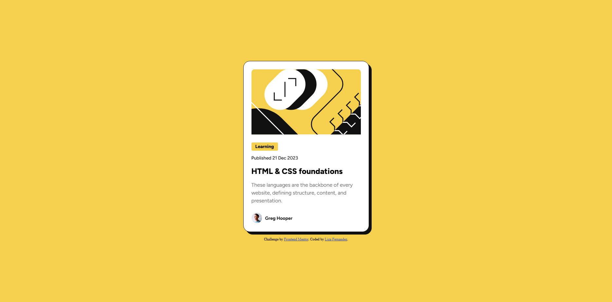
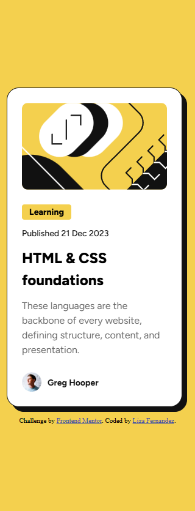

# Frontend Mentor - Blog preview card solution

This is a solution to the [Blog preview card challenge on Frontend Mentor](https://www.frontendmentor.io/challenges/blog-preview-card-ckPaj01IcS). Frontend Mentor challenges help you improve your coding skills by building realistic projects.

## Table of contents

- [Overview](#overview)
  - [The challenge](#the-challenge)
  - [Screenshot](#screenshot)
  - [Links](#links)
- [My process](#my-process)
  - [Built with](#built-with)
  - [What I learned](#what-i-learned)
  - [Continued development](#continued-development)
  - [Useful resources](#useful-resources)
- [Author](#author)

## Overview

### The challenge

Users should be able to:

- See hover and focus states for all interactive elements on the page

### Screenshot

#### Desktop View



#### Mobile View



### Links

- Solution URL: [https://www.frontendmentor.io/solutions/blog-post-preview-challenge-solution-azkvbj3-Jl
  ](https://www.frontendmentor.io/solutions/blog-post-preview-challenge-solution-azkvbj3-Jl)
- Live Site URL: [https://blog-preview-card-challenge-solution.netlify.app](https://blog-preview-card-challenge-solution.netlify.app)

## My process

### Built with

- Semantic HTML5 markup
- CSS custom properties
- Flexbox
- Responsive Web Development (CSS media queries)

### What I learned

While working on this project, I remembered a technique I learned in the past for developing responsive websites. This technique was using CSS media queries to change the width of the card at certain screen sizes so that all content can be seen on mobiles with min-width and max-width of 320px and 390px respectively (code snipped below).

```css
@media only screen and (min-width: 320px) and (max-width: 390px) {
  .card {
    width: 90%;
    margin-right: 0.625rem;
  }
}
```

Overall, my major learning outcomes from this project was reinforcing my knowledge of HTML and CSS.

### Continued development

In the future I would like to work more with a mobile-first workflow. I would also like to practice using CSS media queries again in the future. It would also be good to expand on this project and further develop the code by turning it into a functional blog.

### Useful resources

- [W3Schools](https://www.w3schools.com/css/css_rwd_mediaqueries.asp) - This helped me to find out how to implement CSS media queries and make my website more responsive.

## Author

- Website - [Liza Fernandez](https://www.lizafernandez.dev)
- Frontend Mentor - [@aelvanna](https://www.frontendmentor.io/profile/aelvanna)
